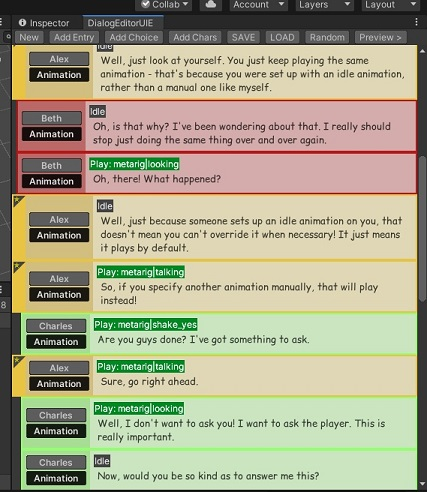
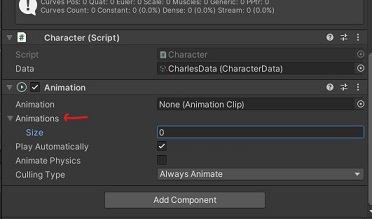
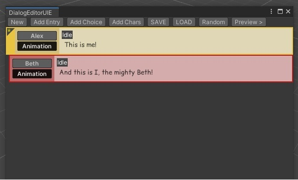

# DialogEditorUIE

A visual dialog editor for Unity build with UIElements. Allows you to create conversations, trigger animations, add choices, and preview in-game from the editor. Basically an ready-made editor for a visual novel sort of game. It also automatically generates AssetBundles, so you can have the same assets between editor and game in a single package. The included project is ready to go, and includes some demo assets and dialog files for you to try.

The pipeline is simple: add your character model to the game as a prefab asset, then add a Character script to it:

Then, create a new CharacterData asset - this is a ScriptableObject with some basic data for you to fill out, like the character name and color in the editor:

Now, drag your CharacterData asset to its respective field in your prefab:

While you're here, you might also want to add an Animation component to your prefab - this editor uses and mixes AnimationClips directly, so it doesn't rely on Animators: 

You're now ready to use this character in the editor! Open the editor by clicking "Custom Editor" on the top menu bar:

This window will appear:

You can add your character by using the AddChar button, and then selecting your prefab:

You can now create dialog using your character! Add an entry, and start typing away!

You can press Enter at the beginning on the text box to switch speakers, or you can also double press Enter in quick succession to add a brand new entry. Right click on entries for extra options, like deleting it or setting the main speaker of the conversation:

To preview your file in-game, just press the preview button. Alternatively, you can save the file to disk as a .dlg file, and use it within your own pipeline!