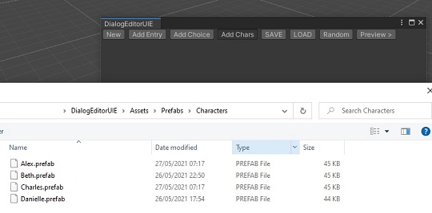
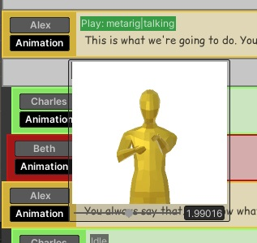

# DialogEditorUIE

A dialog editor for Unity built with UIElements. Allows you to create conversations, trigger animations, add choices, and preview in-game dialog scenes from the editor. Basically serves as a ready-made dialog editor for a visual novel sort of game, with branching conversations between characters, alternating between various animations for reactions and poses. It also automatically generates AssetBundles, so you can have the same assets between editor and game in a single package. The included project is ready to go, and includes some demo assets and **an example dialog file in Assets/Data/Dialog/**

## Setting Up a Character
The pipeline is as follows: add your character model as a prefab, then add a Character script to it:

Then, create a new CharacterData asset - this is a ScriptableObject with some basic data for you to fill out, like the character's name and color in the editor:

Now, drag your CharacterData asset to its respective field in your prefab with the Character script:

While you're here, you might also want to add an Animation component to your prefab - this editor uses and mixes AnimationClips directly, so it doesn't rely on Animators: 

You're now ready to use this character in the editor! Open the editor by clicking "Custom Editor" on the top menu bar:

This window will appear:

You can add your character by using the AddChar button, and then selecting your prefab:

You can now create dialog using your character! Add an entry, and start typing away!

Hover your mouse over the animation button to see a preview of the animation you have set:

## How To Use:
* Press Enter at the beginning on the text box to switch speakers
* Double press Enter in quick succession to add a brand new entry
* Use the Animation button to define an animation for that entry and character
* Right click on entries for extra options, like setting the main speaker of the conversation
* Preview your file in-game by pressing the preview button:

